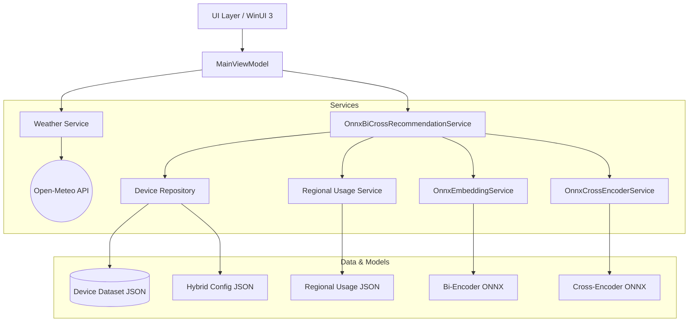

# IoT Device Recommendation (Region Based)

A Windows UI (WinUI 3) desktop application that provides intelligent IoT device recommendations tailored to user needs, location-specific weather patterns, and regional popularity.

This application operates completely offline for its AI inference, utilizing local ONNX models for semantic search and ranking, ensuring privacy and eliminating the need for costly cloud LLM API calls.

## Key Features

- **Context-Aware Recommendations**: Suggests devices based on the selected room and currently owned devices.
- **Smart Season Detection**: Integrates with the Open-Meteo API to fetch real-time weather data based on geographic coordinates (Latitude/Longitude) and intelligently detects the current season (Tropical vs. Temperate logic).
- **Pure ONNX AI Pipeline**: Uses an advanced dual-encoder architecture (Bi-Encoder + Cross-Encoder) running locally to understand user intent and rank devices.
- **Region-Based Scoring**: Adjusts recommendation relevance based on what is popular or practical in a specific region (e.g., S.E. ASIA, NORTH AMERICA, EUROPE).

## Architecture

The application follows a clean MVVM (Model-View-ViewModel) architecture tailored for WinUI 3.

### Component Details

1. **ViewModels & UI**: `MainViewModel.cs` coordinates user inputs and service calls. The UI allows users to specify room, coordinates, and existing devices.
2. **WeatherService**: Retrieves temperature, humidity, and rainfall from the Open-Meteo API. It calculates the season using tropical/temperate heuristics to provide environmental context to the AI.
3. **DeviceRepository**: Handles loading device catalogs, categories, and application configurations from local JSON data.
4. **OnnxBiCrossRecommendationService**: The core AI orchestrator. 
   - **Bi-Encoder (`OnnxEmbeddingService`)**: Embeds the user profile into a dense vector and retrieves the top `N` device candidates from the dataset.
   - **Cross-Encoder (`OnnxCrossEncoderService`)**: Performs a highly accurate pairwise comparison between the user's context and the candidate devices to produce a final ranking.
5. **RegionalUsageService**: Injects regional context, slightly boosting or penalizing scores based on regional usage patterns.

## Data Flow

```mermaid
sequenceDiagram
    participant User
    participant App as MainViewModel
    participant Weather as WeatherService
    participant RecEngine as OnnxBiCrossRecommendationService
    
    User->>App: Provides Input (Room, Lat/Lon, Owned Devices, Region)
    App->>Weather: GetWeatherDataAsync(Lat, Lon)
    Weather-->>App: Current Weather & Season (e.g., "Monsoon")
    
    App->>RecEngine: GetRecommendationsAsync(UserProfile)
    
    rect rgb(30, 40, 50)
        Note right of RecEngine: Offline ONNX Pipeline
        RecEngine->>RecEngine: 1. Parse Owned Devices
        RecEngine->>RecEngine: 2. Bi-Encoder: Retrieve Top-K Candidates
        RecEngine->>RecEngine: 3. Cross-Encoder: Score and Re-rank Candidates
        RecEngine->>RecEngine: 4. Apply Regional Score Adjustments
    end
    
    RecEngine-->>App: Ranked List of RecommendationResults
    App-->>User: Display Recommendations (Name, Score, Rank)
```

## Setup & Running

1. Open `IoTDeviceSuggestionWInUI.sln` in Visual Studio.
2. Ensure you have the Windows App SDK and WinUI 3 workloads installed.
3. Build and run the project.
4. The application expects the following files in the runtime AppData path (base directory):
   - `Data/Dataset_Cleaned_Final_v2_Unique.json`
   - `Data/hybrid_config.json`
   - `Data/combined_by_category.json`
   - `Models/Onnx/sentence Transformer/sentence_transformer.onnx`
   - `Models/Onnx/CrossEncoder/model_O4.onnx`
